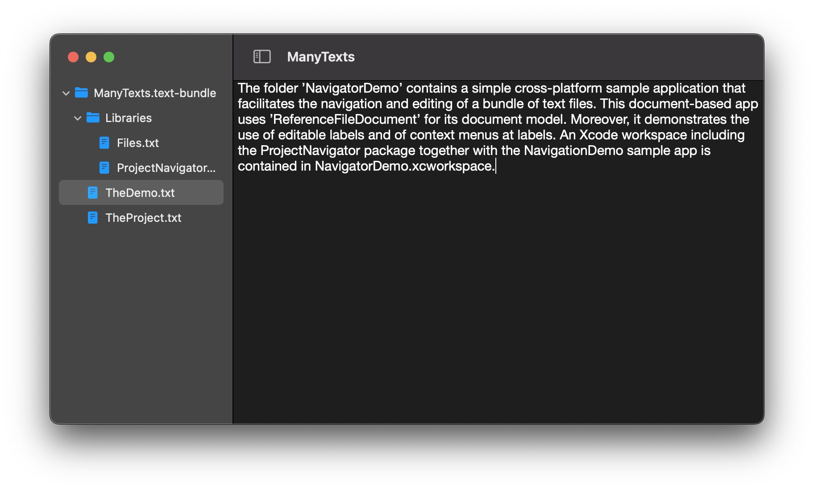
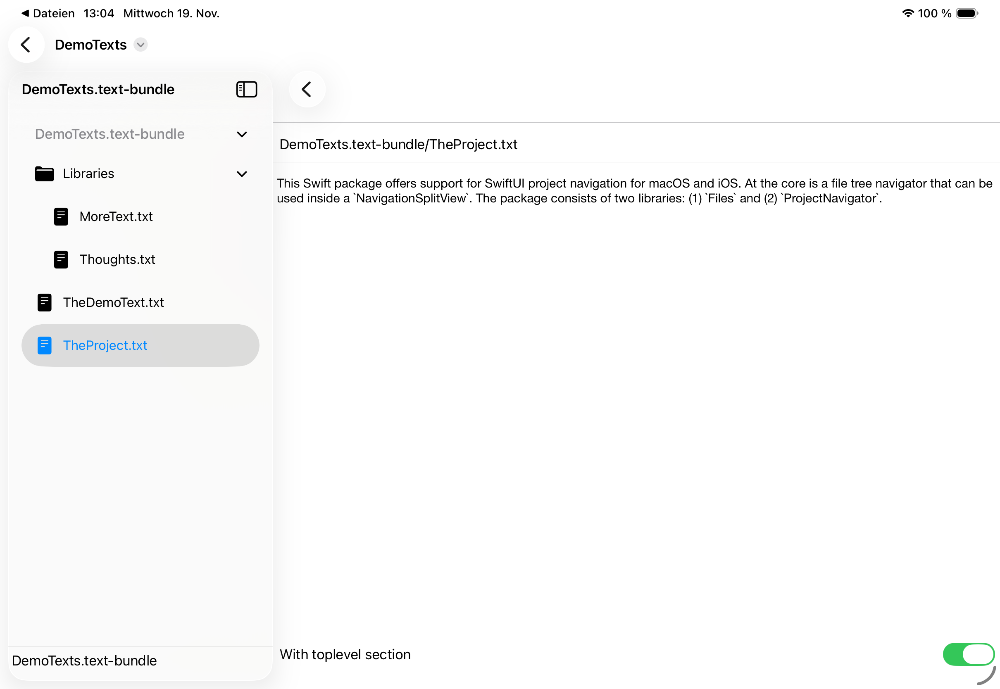

# ProjectNavigator

[](https://swiftpackageindex.com/mchakravarty/ProjectNavigator)
[](https://swiftpackageindex.com/mchakravarty/ProjectNavigator)
[](https://swiftpackageindex.com/mchakravarty/ProjectNavigator/main/documentation/projectnavigator)

*Requirements:* This package requires i(Pad)OS 17 and macOS 14 (Sonoma) to be able to use the `Observation` framework.

This Swift package offers support for SwiftUI project navigation for macOS and iOS. At the core is a file tree navigator that can be used inside a `NavigationSplitView`. The package consists of two libraries: (1) `Files` and (2) `ProjectNavigator`. 

## `Files`

The `Files` library serves as the model representing a file tree that can be marshalled from and to `FileWrapper`s. Individual files and folders are also assigned `UUID`s with support to persist the assignment. This is useful to support persistent view and other configuration. Everything needed to fit into the SwiftUI model for document-based apps is provided.

The `File` data type is generic in a user-defined `Payload` (i.e., the contents of files), whose minimal requirements are given by a protocol of the same name. Multiple file types can be seamlessly combined. As far as possible, file trees are represented as value types and updated via bindings to stay true to the spirit of SwiftUI.

## `ProjectNavigator`

The `FileNavigator` view provides navigation to associated files inside an enclosing `NavigationSplitView`. Both navigation labels as well as the navigation destination view are freely configurable. Context menus can be used to facilitate editing of the file tree. Editable text labels, for the inline editing of file names, are available.

Simple usage (without context menus, editable labels, etc.) is as follows:

```Swift
var body: some View {

  NavigationSplitView {
    List(selection: $viewState.selection) {

      FileNavigator(name: "Root",
                    item: .constant(fileTree.root),
                    parent: .constant(nil),
                    viewState: viewState,
                    fileLabel: { cursor, _editing, _ in Text(cursor.name) },
                    folderLabel: { cursor, _editing, _ in Text(cursor.name) })

    }
    .navigationTitle("Entries")

  } detail: {

    if let uuid = viewState.selection,
       let file = fileTree.proxy(for: uuid).file
    {

      Text(file.contents.text)

    } else {

      Text("Select a file")

    }
  }
}
```

## NavigatorDemo

The folder [`NavigatorDemo`](NavigatorDemo) contains a simple cross-platform sample application that facilitates the navigation and editing of a bundle of text files. This document-based app uses `ReferenceFileDocument` for its document model. Moreover, it demonstrates the use of editable labels and of context menus at labels. An Xcode workspace including the `ProjectNavigator` package together with the `NavigationDemo` sample app is contained in [`NavigatorDemo.xcworkspace`](NavigatorDemo.xcworkspace).





## Documentation

You may want to browse the DocC documentation for the [`Files` target](https://swiftpackageindex.com/mchakravarty/ProjectNavigator/main/documentation/files) and the [`ProjectNavigator` target](https://swiftpackageindex.com/mchakravarty/ProjectNavigator/main/documentation/projectnavigator). The documentation is kindly being built and hosted by the [Swift Package Index](https://swiftpackageindex.com).

## License

Copyright [2022..2023] Manuel M. T. Chakravarty. 

Distributed under the Apache-2.0 license — see the [license file](LICENSE) for details.
